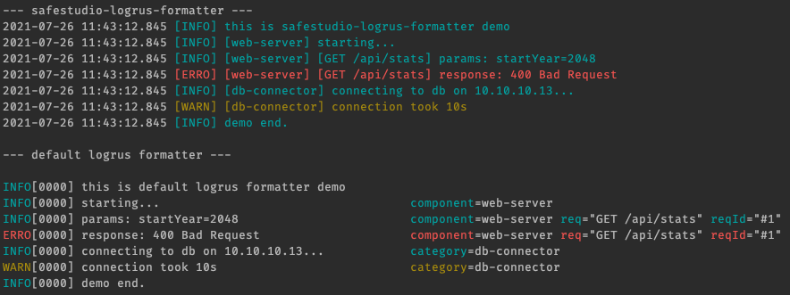

# logrus-formatter

Forked from [antonfisher/nested-logrus-formatter](https://github.com/antonfisher/nested-logrus-formatter)

Human-readable log formatter, converts _logrus_ fields to a nested structure:



## Configuration:

```go
type Formatter struct {
	/**
	FieldsOrder
	Default:
	- time
	- level
	- called_file (if report caller was enabled)
	- called_function (if report caller was enabled)
	- other fields (sorted alphabetically)
	- message
	*/
	FieldsOrder []string

	// TimestampFormat - default: "2006-01-02 15:04:05.000"
	TimestampFormat string

	// HideKeys - show [fieldValue] instead of [fieldKey:fieldValue]
	HideKeys bool

	// NoColors - disable colors
	NoColors bool

	// NoFieldsColors - apply colors only to the level, default is level + fields
	NoFieldsColors bool

	// NoFieldsSpace - no space between fields
	NoFieldsSpace bool

	// ShowFullLevel - show a full level [WARNING] instead of [WARN]
	ShowFullLevel bool

	// NoUppercaseLevel - no upper case for level value
	NoUppercaseLevel bool

	// TrimMessages - trim white spaces on messages
	TrimMessages bool
}
```

## Usage

```go
import (
	nested "github.com/SafeStudio/logrus-formatter"
	"github.com/sirupsen/logrus"
)

log := logrus.New()
log.SetFormatter(&nested.Formatter{
	HideKeys:    true,
	FieldsOrder: []string{"component", "category"},
})

log.Info("just info message")
// Output: 2006-01-02 15:04:05.000 [INFO] just info message

log.WithField("component", "rest").Warn("warn message")
// Output: 2006-01-02 15:04:05.000 [WARN] [rest] warn message
```

See more examples in the [formatter_test.go](./formatter_test.go) file.

## Development

```bash
# run tests:
make test

# run demo:
make demo
```
